# TrainerSamay

A simple, full-stack **trainer scheduling and management system** built with **Django** and **React + Vite + Tailwind CSS**.  
Designed for **training centers** to help both **trainers** and **admins** manage schedules, availability, and reports.


---

## Project Objective

Training centers often struggle to keep trainers informed of their upcoming sessions in a clear and centralized way.  
This platform solves that problem with a **calendar-based app** that connects to an SQL database and displays each trainer's class schedule in a clean, intuitive interface.


---

## Key Features

- **Secure Authentication** – Via tokens and sessions using Django REST Framework  
- **Trainer Login** – Login via email (from `member` table) and view only the trainer's own sessions  
- **Interactive Dashboard** – Highlights today's and upcoming sessions  
- **Calendar-Based Scheduling** – Sessions fetched from `trainer_utilization` table  
- **Availability Management** – Trainers can update their availability directly  
- **Smart Scheduling (Admin)** – View all trainers’ schedules, filter by trainer, and manage sessions  
- **Auto Absence Detection** – Automatically marks sessions as "Absent" if not started on time  
- **Export Reports** – Export filtered session reports to CSV  
- **Responsive UI** – Built with ShadCN UI and Tailwind CSS, supporting light and dark modes  


---

## Application Screenshots

### Authentication

| Login Page |
|:-----------:|
| 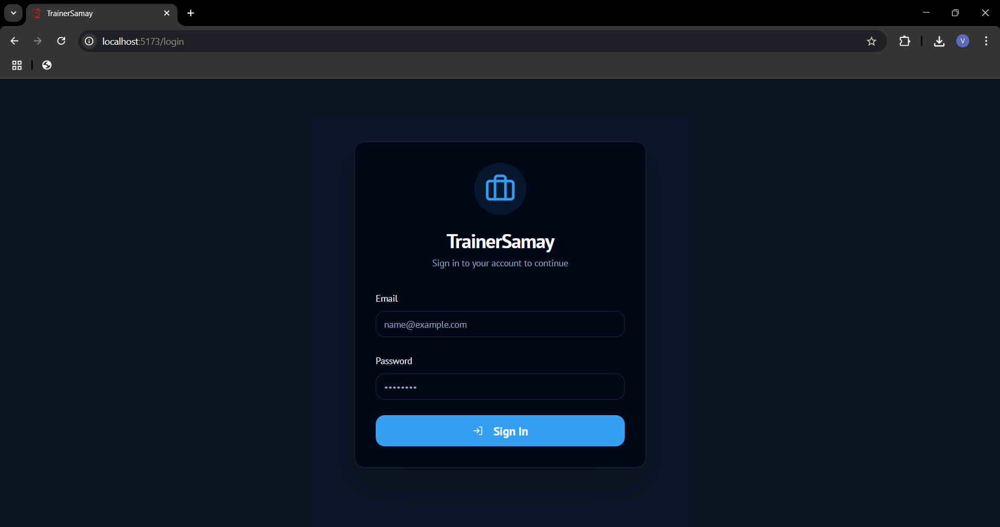 |
| *Secure email-based login for trainers and admins* |


---

### Admin Experience

#### Dashboard Overview

| Admin Dashboard | Reports & Analytics |
|:----------------:|:-------------------:|
| 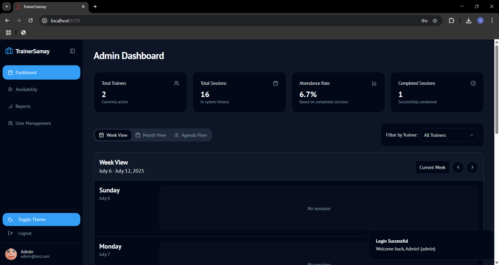 | 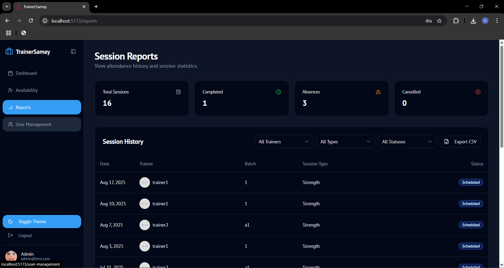 |
| *Trainer utilization, session stats, and insights* | *Comprehensive reporting interface* |


#### User and Availability Management

| User Management | User Creation | Availability |
|:----------------:|:--------------:|:-------------:|
| 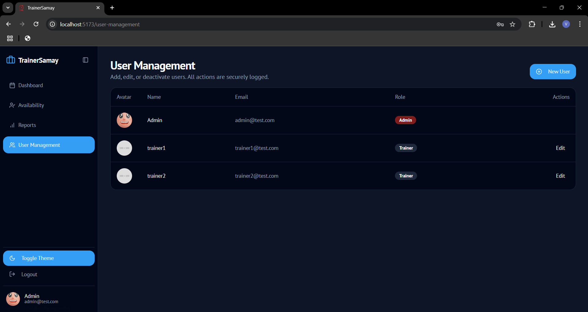 | 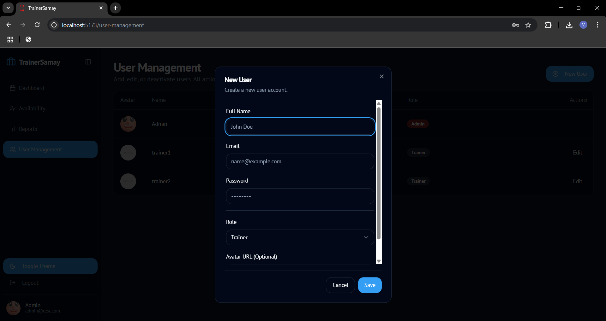 | 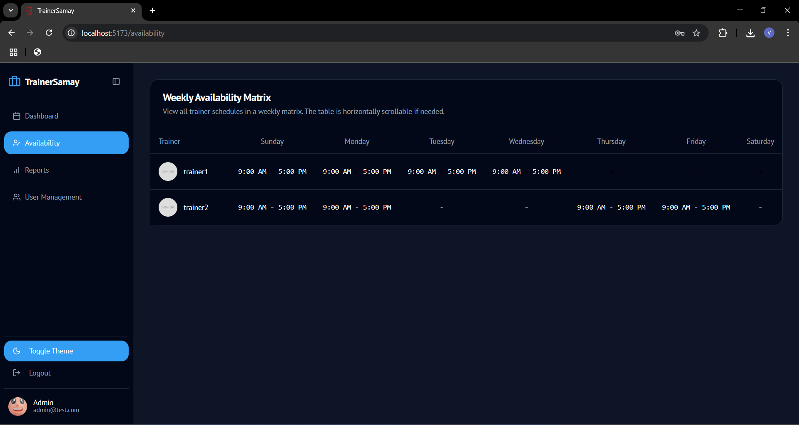 |
| *Manage trainer/admin accounts* | *Create new users with role assignment* | *View trainer availability* |


#### Scheduling and Calendar

| Calendar View | Agenda View |
|:---------------:|:-------------:|
| 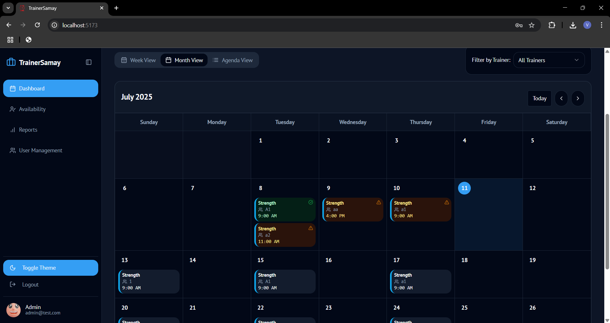 | 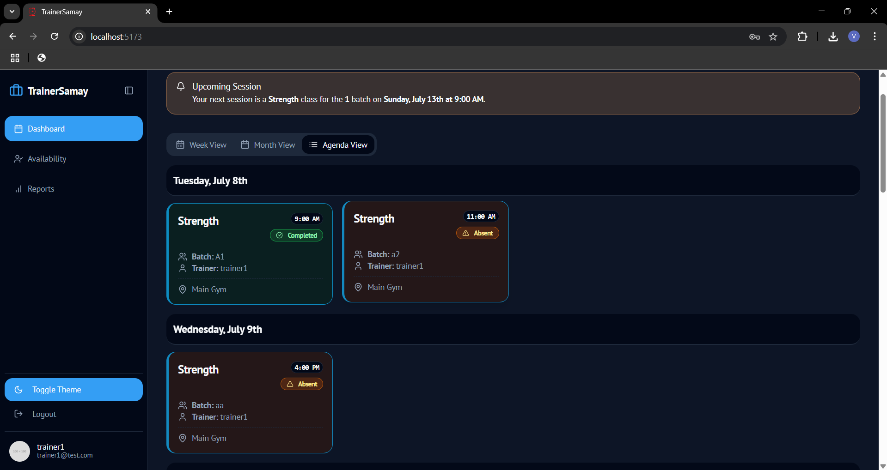 |
| *Monthly/weekly calendar with sessions* | *Detailed list of upcoming sessions* |


---

### Trainer Experience

| Trainer Dashboard | Trainer Calendar |
|:------------------:|:----------------:|
| 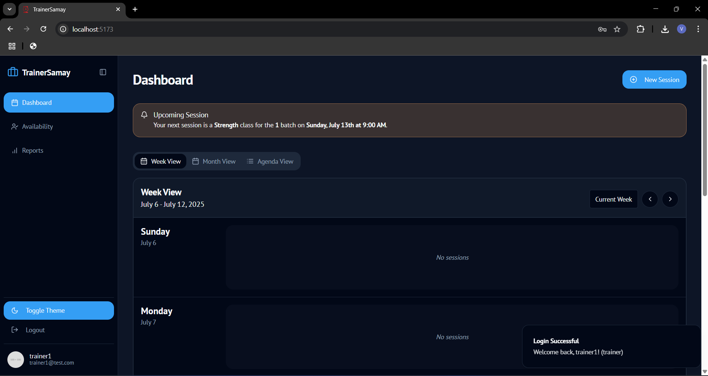 | 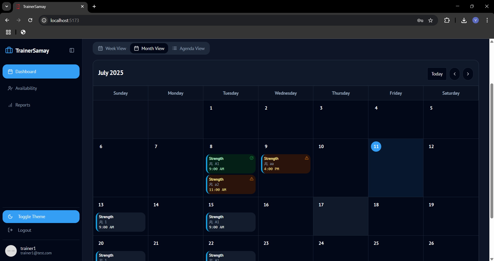 |
| *Upcoming sessions overview* | *Personalized calendar view* |


| Add Session | Advanced Scheduling | Start Session |
|:-------------:|:-------------------:|:--------------:|
|  | 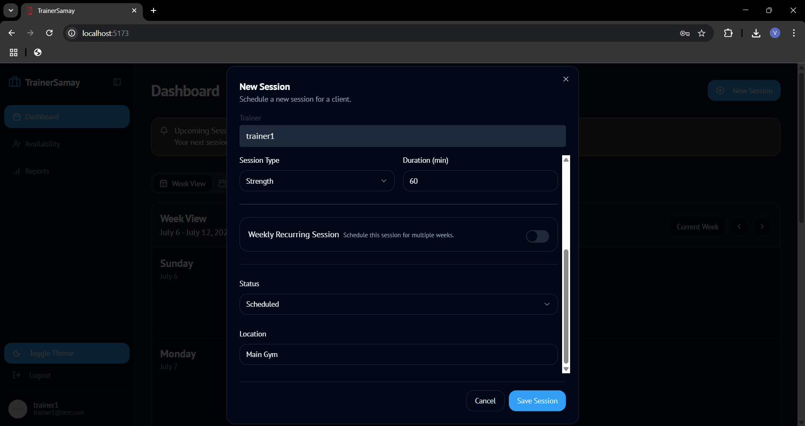 | 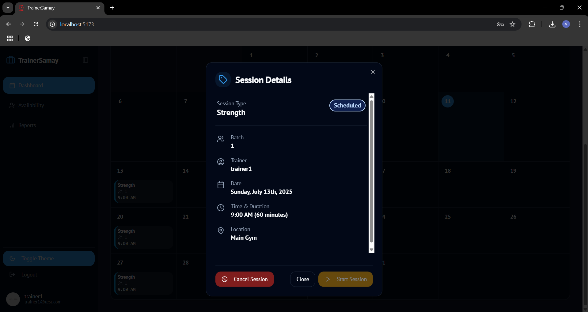 |
| *Add new sessions with validation* | *Set trainer, course, and time slots* | *Begin and track attendance* |


| Trainer Profile | Trainer Availability |
|:----------------:|:-------------------:|
|  | 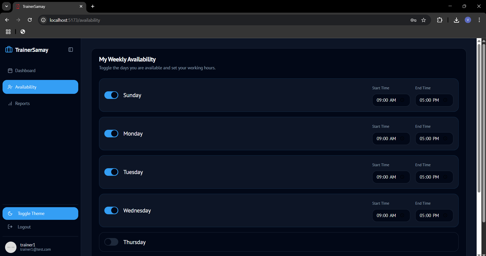 |
| *Manage personal info* | *Set weekly availability* |


---

## Tech Stack

### Backend

- **Framework:** Django 5.x  
- **API Development:** Django REST Framework  
- **Database:** MySQL / SQLite  
- **CORS Handling:** django-cors-headers  
- **Environment Management:** python-dotenv  


### Frontend

- **Framework:** React 18 with TypeScript  
- **Build Tool:** Vite  
- **Styling:** Tailwind CSS + ShadCN UI  
- **State & Forms:** React Hook Form + Zod  
- **Routing:** React Router DOM  
- **Charts:** Recharts  
- **Animations:** Framer Motion  
- **Icons:** Lucide React  


---

## API Endpoints

### Authentication Endpoints

| Method | Endpoint | Description |
|:--------|:----------|:-------------|
| **POST** | `/api/auth/login/` | User login |
| **POST** | `/api/auth/logout/` | User logout |
| **POST** | `/api/auth/register/` | Admin creates new user |


### User Management

| Method | Endpoint | Description |
|:--------|:----------|:-------------|
| **GET** | `/api/users/` | List all users (Admin only) |
| **POST** | `/api/users/` | Create new user (Admin only) |
| **PUT** | `/api/users/{id}/` | Update user details |
| **DELETE** | `/api/users/{id}/` | Remove user |


### Sessions

| Method | Endpoint | Description |
|:--------|:----------|:-------------|
| **GET** | `/api/sessions/` | List sessions |
| **POST** | `/api/sessions/` | Create session |
| **PUT** | `/api/sessions/{id}/` | Update session details |
| **DELETE** | `/api/sessions/{id}/` | Delete session |


### Availability

| Method | Endpoint | Description |
|:--------|:----------|:-------------|
| **GET** | `/api/availability/` | Fetch trainer availability |
| **POST** | `/api/availability/` | Add or update availability |
| **PUT** | `/api/availability/{id}/` | Modify availability details |


---

## Installation

### 1. Clone the Repository

```bash
git clone https://github.com/IJNikhil/TrainerSamay.git
cd trainersamay
```


### 2. Backend Setup (Django)

```bash
cd backend
python -m venv venv
source venv/bin/activate  # macOS/Linux
# venv\Scripts\activate  # Windows

pip install -r requirements.txt
```

Create a `.env` file in `backend/` with:

```env
DB_ENGINE=mysql
DB_HOST=localhost
DB_PORT=3306
DB_NAME=your_db_name
DB_USER=your_db_user
DB_PASSWORD=your_db_password

SECRET_KEY=your-django-secret-key
DEBUG=True
ALLOWED_HOSTS=localhost,127.0.0.1

CORS_ALLOW_ALL_ORIGINS=True
CORS_ALLOWED_ORIGINS=http://localhost:5173
CORS_ALLOW_CREDENTIALS=True
```

Then run migrations and start the server:

```bash
python manage.py migrate
python manage.py seedadmin
python manage.py runserver
```


### 3. Frontend Setup (React + Vite)

```bash
cd frontend
npm install
npm run dev
```

Your app will run at: **http://localhost:5173**


---

## Auto-Absence Detection

Sessions are automatically marked “Absent” if not started after a configured grace period.

```bash
python manage.py mark_absent_sessions
```

Script Location: `core/management/commands/mark_absent_sessions.py`  
Run every 5 minutes via cron or scheduler.


---

## Developer Notes

- **Admin Panel:** http://localhost:8000/admin  
- **Timezone:** Asia/Kolkata  
- **Custom User Model:** `core.User`  
- **Auth Backend:** `core.backends.EmailBackend`  


---

## License

**MIT License**  

You are free to use, modify, and distribute this project.  
Refer to the [LICENSE](LICENSE) file for more details.


---

## Contributing

1. Fork the repository  
2. Create a new branch  
3. Commit and push your changes  
4. Open a pull request  


---

## Contact

- **Repository:** [TrainerSamay on GitHub](https://github.com/IJNikhil/TrainerSamay)  
- **Developer:** IJNikhil  
- **Issues:** [GitHub Issues](https://github.com/IJNikhil/TrainerSamay/issues)

