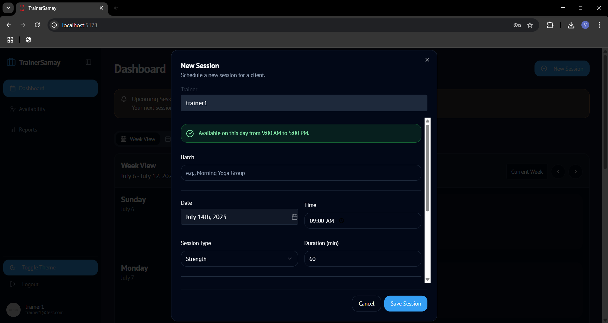
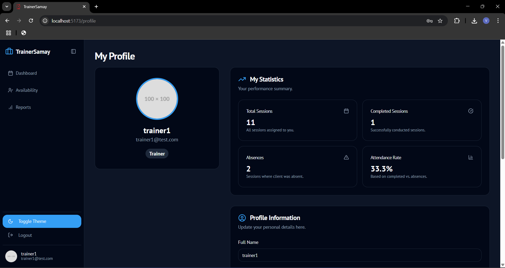

# TrainerSamay

A simple, full-stack **trainer scheduling and management system** built with **Django** and **React + Vite + Tailwind CSS**.  
Designed for **training centers** to help both **trainers** and **admins** manage schedules, availability, and reports.

---

## Project Objective

Training centers often struggle to keep trainers informed of their upcoming sessions in a clear and centralized way.  
This platform solves that problem with a **calendar-based app** that connects to an SQL database and displays each trainer's class schedule in a clean, intuitive interface.

---

## Key Features

- **Secure Authentication:** Via tokens and sessions using Django REST Framework  
- **Trainer Login:**  
  - Login via email (from `member` table)  
  - View only the trainer's own sessions  
- **Interactive Dashboard:**  
  - Highlights today's and upcoming sessions  
  - Admins get a complete overview; trainers see their own calendar  
- **Calendar-Based Scheduling:**  
  - Sessions fetched from `trainer_utilization` table  
  - Monthly, weekly, and agenda calendar views  
  - Display course name, time, and location on hover or click  
- **Availability Management (Trainer):** Trainers can update their availability directly  
- **Smart Scheduling (Admin):**  
  - Admins can view all trainers' schedules  
  - Filter sessions by trainer  
  - Create, modify, or delete any session  
- **Simple Admin Management:** Add, update, or remove trainer and admin users  
- **Auto Absence Detection:** Automatically marks sessions as "Absent" if not started on time  
- **Export Reports:** Export filtered session reports to CSV  
- **Responsive UI:** Built with ShadCN UI and Tailwind CSS, supporting light and dark modes

---

## Application Screenshots

### Authentication

| Login Page |
|:-----------:|
|  |
| *Secure email-based login for trainers and admins* |

---

### Admin Experience

#### Dashboard Overview

| Admin Dashboard | Reports & Analytics |
|:----------------:|:-------------------:|
|  |  |
| *Trainer utilization, session stats, and quick insights* | *Comprehensive session analytics and reporting* |

#### User and Availability Management

| User Management | User Creation | Availability |
|:----------------:|:--------------:|:-------------:|
|  |  |  |
| *Manage trainer/admin accounts* | *Create new users with role assignment* | *View trainer availability* |

#### Scheduling and Calendar

| Calendar View | Agenda View |
|:---------------:|:-------------:|
|  |  |
| *Monthly or weekly calendar with color-coded sessions* | *Detailed agenda of upcoming sessions* |

| Session Details | Export Reports |
|:----------------:|:---------------:|
|  |  |
| *View and manage session details* | *Export session data and analytics* |

---

### Trainer Experience

#### Personal Dashboard and Calendar

| Trainer Dashboard | Trainer Calendar |
|:------------------:|:----------------:|
|  |  |
| *Upcoming sessions at a glance* | *Personalized calendar view* |

#### Session Scheduling and Management

| Add Session | Advanced Scheduling | Start Session |
|:-------------:|:-------------------:|:--------------:|
|  |  |  |
| *Add new sessions with conflict detection* | *Advanced scheduling with trainer/time selection* | *Start sessions and track attendance* |

#### Profile and Availability

| Trainer Profile | Trainer Availability |
|:----------------:|:-------------------:|
|  |  |
| *Manage personal information and preferences* | *Set and update weekly availability* |

#### Reports

| Trainer Reports | Exported Reports |
|:----------------:|:----------------:|
|  |  |
| *View session history and stats* | *Export personal session data* |

---

## Tech Stack

### Backend
- **Django 5.x** – Web framework  
- **Django REST Framework** – API development  
- **MySQL/SQLite** – Database (configurable)  
- **django-cors-headers** – CORS handling  
- **python-dotenv** – Environment variable management  

### Frontend
- **React 18** – UI library  
- **TypeScript** – Type safety  
- **Vite** – Build tool and dev server  
- **React Router DOM** – Client-side routing  
- **React Hook Form** – Form management  
- **Zod** – Schema validation  
- **Recharts** – Data visualization  
- **ShadCN UI** – UI components  
- **Tailwind CSS** – Styling  
- **Framer Motion** – Animations  
- **Lucide React** – Icons  

---

## Project Structure

```
trainersamay/
├── backend/                     # Django backend
│   ├── core/                    # Main app backend
│   ├── trainersamay/            # Django settings
│   │   ├── settings.py
│   │   ├── urls.py
│   │   └── wsgi.py
│   ├── .env
│   ├── manage.py
│   └── requirements.txt
├── frontend/                    # React + Vite + Tailwind frontend
│   ├── src/
│   │   ├── api/                 # Files to connect frontend with backend
│   │   ├── ...                  # Remaining files
│   ├── .env
│   ├── package.json
│   ├── vite.config.ts
│   └── tailwind.config.js
└── README.md
```

---

## Quickstart

### 1. Clone the Repository

```bash
git clone https://github.com/IJNikhil/TrainerSamay.git
cd trainersamay
```

### 2. Backend Setup (Django)

```bash
cd backend
python -m venv venv

# Activate virtual environment
source venv/bin/activate        # For Linux/macOS
# venv\Scripts\activate         # For Windows

pip install -r requirements.txt
```

Create a `.env` file and configure database credentials, then run:

```bash
python manage.py migrate
python manage.py seedadmin    # Creates admin user with default credentials
python manage.py runserver
```

**Sample `.env` (Backend)**

```env
# Database
DB_ENGINE=mysql
DB_HOST=localhost
DB_PORT=3306
DB_NAME=your_db_name
DB_USER=your_db_user
DB_PASSWORD=your_db_password

# Django
SECRET_KEY=your-django-secret-key
DEBUG=True
ALLOWED_HOSTS=localhost,127.0.0.1

# CORS
CORS_ALLOW_ALL_ORIGINS=True
CORS_ALLOWED_ORIGINS=http://localhost:5173,http://localhost:3000,http://localhost:9002
CORS_ALLOW_CREDENTIALS=True
```

### 3. Frontend Setup (React + Vite)

```bash
cd frontend
npm install
npm run dev
```

Your app will be available at **http://localhost:5173**

**Sample `.env` (Frontend)**

```env
VITE_API_URL=http://localhost:8000/api
REACT_APP_API_URL=http://localhost:8000/api
```

---

## Auto-Absence Marking

Sessions are automatically marked "Absent" if not started after a grace period.

- **Logic:** `core/management/commands/mark_absent_sessions.py`  
- **Execution:** Runs every 5 minutes to check the database

```bash
python manage.py mark_absent_sessions
```

---

## Authentication

- Login via email (custom Django backend)  
- DRF Token and Session authentication  
- Tokens stored in localStorage for secure API access  
- Role-based access control (admin vs trainer)

---

## API Endpoints

### Authentication
- `POST /api/auth/login/` – User login  
- `POST /api/auth/logout/` – User logout  
- `POST /api/auth/register/` – Admin-only registration  

### User Management
- `GET /api/users/` – List all users (admin)  
- `POST /api/users/` – Create new user (admin)  
- `PUT /api/users/{id}/` – Update user (admin)  
- `DELETE /api/users/{id}/` – Delete user (admin)  

### Sessions
- `GET /api/sessions/` – List sessions  
- `POST /api/sessions/` – Create new session  
- `PUT /api/sessions/{id}/` – Update session  
- `DELETE /api/sessions/{id}/` – Delete session  

### Availability
- `GET /api/availability/` – Get trainer availability  
- `POST /api/availability/` – Set trainer availability  
- `PUT /api/availability/{id}/` – Update availability  

---

## Installation Commands

### Backend Requirements
```bash
pip install django djangorestframework python-dotenv django-cors-headers mysqlclient
```

*If using SQLite for local development, `mysqlclient` is not required.*

### Frontend Requirements
```bash
npm install react react-dom react-router-dom vite typescript tailwindcss \
  @radix-ui/react-accordion @radix-ui/react-alert-dialog @radix-ui/react-avatar \
  @radix-ui/react-checkbox @radix-ui/react-dropdown-menu @radix-ui/react-label \
  @radix-ui/react-select @radix-ui/react-tabs @radix-ui/react-toast \
  react-hook-form @hookform/resolvers zod date-fns lucide-react recharts \
  framer-motion class-variance-authority clsx tailwind-merge
```

---

## Developer Notes

- **Admin Panel:** http://localhost:8000/admin  
- **Timezone:** Asia/Kolkata  
- **Custom User Model:** `core.User`  
- **Custom Auth Backend:** `core.backends.EmailBackend`  
- **Database Tables:** `member`, `trainer_utilization`

---

## Deployment

### Backend Deployment

1. **Production Environment Variables**
   ```env
   DEBUG=False
   ALLOWED_HOSTS=yourdomain.com,www.yourdomain.com
   SECRET_KEY=your-production-secret-key
   DB_ENGINE=mysql
   ```
2. **Collect Static Files**
   ```bash
   python manage.py collectstatic
   ```
3. **Run Production Server**
   ```bash
   gunicorn trainersamay.wsgi:application
   ```

### Frontend Deployment

1. **Build for Production**
   ```bash
   npm run build
   ```
2. **Deploy** to Netlify, Vercel, or another hosting provider.

---

## Development

### Backend
```bash
python manage.py test
python manage.py makemigrations
python manage.py migrate
python manage.py createsuperuser
```

### Frontend
```bash
npm run dev
npm run build
```

---

## FAQ

**Q:** Why aren't absences marked automatically?  
**A:** Run `python manage.py mark_absent_sessions` periodically via cron or scheduler.

**Q:** How do I add more roles?  
**A:** Extend `core.User` and update permission logic using DRF.

**Q:** How do I deploy it?  
**A:** Use Gunicorn + Nginx for Django and deploy React frontend on Netlify or Vercel.

**Q:** Can I use SQLite instead of MySQL?  
**A:** Yes, set `DB_ENGINE=sqlite3` in your `.env`.

**Q:** How do I reset the database?  
**A:** Delete migrations, then run `makemigrations` and `migrate`.

---

## Contributing

1. Fork the repository  
2. Create a new branch (`git checkout -b feature/your-feature`)  
3. Commit your changes (`git commit -m "Add your feature"`)  
4. Push the branch (`git push origin feature/your-feature`)  
5. Open a Pull Request

---

## License

**MIT License** – Free to use, modify, and distribute.

---

## Support

For help, please create an issue in the repository or contact the development team.

---

## Contact

- **Repository:** [TrainerSamay on GitHub](https://github.com/IJNikhil/TrainerSamay)  
- **Developer:** IJNikhil  
- **Issues:** [GitHub Issues](https://github.com/IJNikhil/TrainerSamay/issues)
